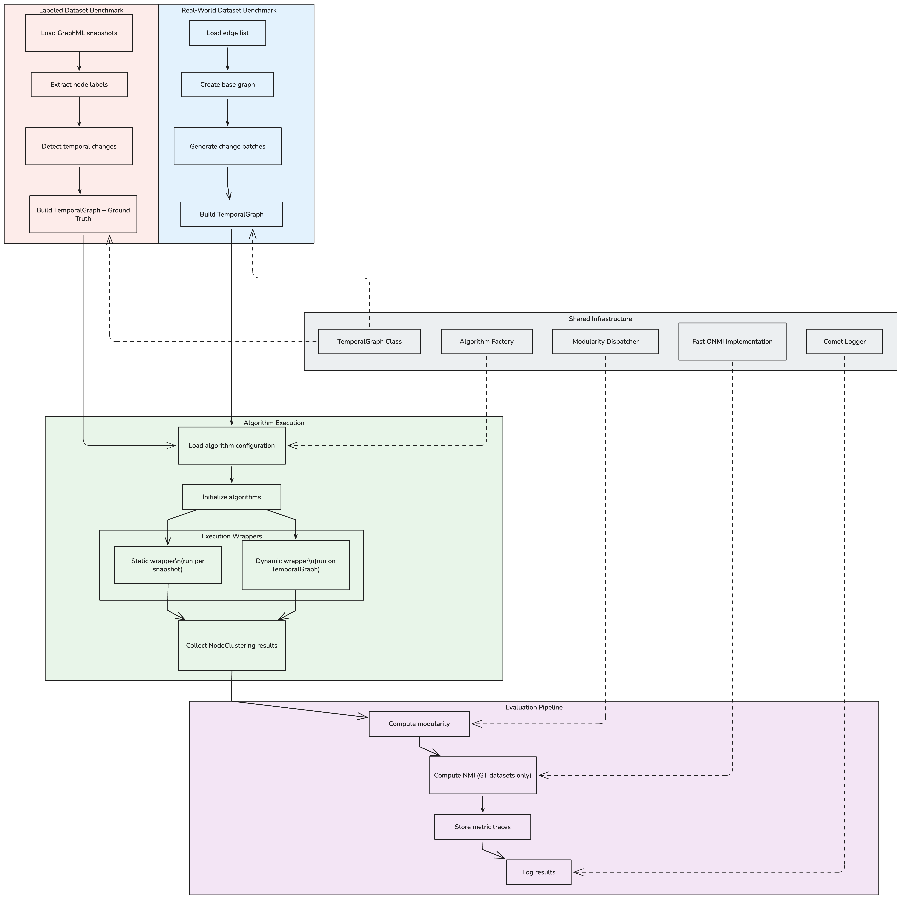

# Architecture

## System Overview



The Graph Communities Benchmark supports two primary benchmarking workflows:

1. **Real-world benchmarking** — Edge list files → temporal snapshots → benchmark
2. **Labeled benchmarking** — GraphML snapshots → temporal graph → benchmark with ground truth

---

## Benchmarking Workflows

### Case 1: Real-World Dataset Benchmarking

```
Edge list file (txt/csv)
    └─► DataReader.load_from_edge_list()
            ├── Parse edges with timestamps
            ├── Build base graph (initial_fraction of edges)
            └── Create TemporalChanges batches (batch_range)
                    └─► TemporalGraph
                            ├── base_graph (t=0)
                            └── steps[] (insertions/deletions per snapshot)
                                    └─► Algorithm Factory
                                            ├── StaticWrapper → runs on each snapshot independently
                                            └── DynamicWrapper → consumes full TemporalGraph
                                                    └─► Evaluation Pipeline
                                                            ├── compute_modularity()
                                                            └── log_results() → Comet ML
```
### Case 2: Labeled Dataset Benchmarking (with Ground Truth)

```
GraphML snapshot folder (snapshot_t0.graphml, snapshot_t1.graphml, ...)
    └─► DataReader.load_from_graphml_folder()
            ├── Load snapshot_t0 as base graph
            ├── Extract node['label'] attributes → ground truth communities
            ├── Load snapshot_t1..tN
            └── Diff consecutive snapshots → TemporalChanges
                    └─► TemporalGraph + Ground Truth
                            ├── base_graph with node attrs
                            ├── steps[] (insertions/deletions)
                            ├── ground_truth: Communities (crisp or overlapping)
                            └── gt_type: "crisp" | "overlapping"
                                    └─► Algorithm Factory
                                            ├── StaticWrapper → runs on each snapshot independently
                                            └── DynamicWrapper → consumes full TemporalGraph
                                                    └─► Evaluation Pipeline
                                                            ├── compute_modularity()
                                                            ├── compute_nmi_from_ground_truth()
                                                            └── log_results() → Comet ML
```

---

## Key Components

### Data Loading — `src/dataloader/data_reader.py`

| Method | Description |
|--------|-------------|
| `load_from_edge_list()` | Parse txt/csv edge lists into a `TemporalGraph` |
| `load_from_graphml_folder()` | Load a series of GraphML snapshots |
| `extract_ground_truth()` | Parse node label attributes (crisp or overlapping) |

### Core Abstractions — `src/factory/`

**`TemporalGraph`** (`src/factory/factory.py`)
- `base_graph` — NetworkX graph at t=0
- `steps[]` — List of `TemporalChanges` (edge insertions/deletions per batch)
- `__getitem__(idx)` — Reconstruct snapshot at time t
- `iter_snapshots()` — Iterate all snapshots in order
- `average_changes_per_snapshot()` — Temporal evolution metric

### Algorithm Layer — `src/algorithms/`

**`CommunityDetectionAlgorithm`** (`base.py`) — Abstract base for all algorithms
- `__call__(tg) -> List[NodeClustering]`

**`StaticMethodWrapper`** (`wrappers.py`)
- Applies a snapshot-level algorithm to each snapshot independently
- Returns one `NodeClustering` per snapshot

**`DynamicMethodWrapper`** (`wrappers.py`)
- Passes the full `TemporalGraph` to a temporal algorithm
- Returns a `MethodDynamicResults` with pre-computed per-snapshot results

### Evaluation Layer — `src/evaluations/`

**`compute_modularity()`** (`metrics.py`)
- Crisp communities: Newman-Girvan modularity
- Overlapping communities: CDlib `modularity_overlap` + custom Q0 formula

**`compute_nmi_from_ground_truth()`** (`metrics.py`)
- Crisp ground truth: Standard NMI
- Overlapping ground truth: MGH ONMI via fast vectorized implementation

**Fast ONMI** (`onmi_fast.py`)
- `onmi_score()` — Vectorized MGH/LFK computation
- `overlapping_normalized_mutual_information_MGH_fast()` — CDlib-compatible wrapper
- ~770× speedup over the CDlib reference implementation (identical results)

### Result Models — `src/factory/communities.py`

**`NodeClustering`** (CDlib object)
- `communities` — List of node sets
- `graph` — Associated NetworkX graph

**`MethodDynamicResults`**
- `clusterings` — `List[NodeClustering]`, one per snapshot
- `runtime_trace` — Per-snapshot wall-clock runtimes
- `cdlib_modularity_overlap_trace` — CDlib modularity per snapshot
- `customize_q0_overlap_trace` — Q0 modularity per snapshot
- `nmi_trace` — Ground truth NMI per snapshot

### Logging Layer — `src/pipeline_utils.py`

Comet ML integration logs one experiment per benchmark run:
- **Parameters**: contents of `config/algorithms.yaml` + CLI arguments
- **Step metrics**: per-snapshot values (modularity, NMI, runtime)
- **Summary metrics**: averages across all snapshots

---

## Configuration

### `config/algorithms.yaml`

```yaml
target_algorithms: [coach, tiles, ...]

algorithms:
  coach:
    module: "cdlib.algorithms"
    function: "coach"
    type: "static"              # static | dynamic
    clustering_type: "overlapping"  # crisp | overlapping
    params: {}
  tiles:
    module: "cdlib.algorithms"
    function: "tiles"
    type: "dynamic"
    clustering_type: "overlapping"
    params: {}
```

### `config/dataset_config.yaml`

```yaml
target_datasets: [college-msg, ...]

common:
  max_steps: 50
  initial_fraction: 0.1
  batch_range: [100, 500]

datasets:
  college-msg:
    path: "data/CollegeMsg.txt"
    delimiter: " "
```

---

## Workflow Comparison

| Aspect | Real-World (Edge List) | Labeled (GraphML Snapshots) |
|--------|------------------------|-----------------------------|
| Data source | Single txt/csv file | Folder of GraphML files |
| Loader | `load_from_edge_list()` | `load_from_graphml_folder()` |
| Temporal construction | Batches edges by count | Diffs consecutive snapshots |
| Ground truth | None | Extracted from node attributes |
| Evaluation | Modularity | Modularity + NMI |

---

## Performance

| Metric | Implementation | Speed |
|--------|---------------|-------|
| Modularity | Newman-Girvan / CDlib | < 1 ms/snapshot |
| ONMI (CDlib) | Reference implementation | ~10 s/snapshot (large graphs) |
| ONMI (fast) | Vectorized MGH formula | ~13 ms/snapshot (large graphs) |

**Static vs. Dynamic algorithms:**

- **Static** — Simple, parallelizable, deterministic per snapshot; ignores temporal structure. Examples: `coach`, `angel`, `graph_entropy`, `big_clam`.
- **Dynamic** — Exploits temporal structure with incremental updates; more complex state management. Examples: `df_louvain`, `tiles`.

---

## Extending the Benchmark

### Add a new static algorithm
1. Create a class inheriting `CommunityDetectionAlgorithm` in `src/algorithms/`
2. Implement `__call__(tg) -> List[NodeClustering]`
3. Add an entry to `config/algorithms.yaml`
4. Add the key to `target_algorithms`

### Add a new dynamic algorithm
1. Create a class inheriting `CommunityDetectionAlgorithm`
2. Access `tg.steps` for temporal changes and maintain internal state
3. Return a `MethodDynamicResults` object
4. Register in `config/algorithms.yaml`

### Add a new metric
1. Implement the metric function in `src/evaluations/`
2. Call it from `evaluate()` in `src/pipeline_utils.py`
3. Add the trace field to `MethodDynamicResults`
4. Log to Comet ML via `log_results()`

---

## Pipeline Diagram

```mermaid
graph TB
    subgraph Case1["Real-World Dataset Benchmarking"]
        Start1(["Start"]) --> LoadEdgeList["DataReader.load_from_edge_list()"]

        subgraph DataLoading1["Temporal Graph Construction"]
            LoadEdgeList --> CreateBaseGraph["Create base graph (initial_fraction)"]
            CreateBaseGraph --> CreateBatches["Create change batches (batch_range)"]
            CreateBatches --> BuildTG1["TemporalGraph"]
        end

        BuildTG1 --> LoadAlgos1["Load config/algorithms.yaml"]
        LoadAlgos1 --> InitStatic1["Init static algorithms"]
        LoadAlgos1 --> InitDynamic1["Init dynamic algorithms"]

        subgraph Exec1["Algorithm Execution"]
            InitStatic1 --> RunStatic1["StaticWrapper: per-snapshot"]
            InitDynamic1 --> RunDynamic1["DynamicWrapper: full graph"]
            RunStatic1 --> Results1["NodeClustering per snapshot"]
            RunDynamic1 --> Results1
        end

        subgraph Eval1["Evaluation"]
            Results1 --> Mod1["compute_modularity()"]
            Mod1 --> Log1["log_results() → Comet ML"]
        end

        Log1 --> End1(["Done"])
    end

    subgraph Case2["Labeled Dataset Benchmarking"]
        Start2(["Start"]) --> LoadGraphML["DataReader.load_from_graphml_folder()"]

        subgraph DataLoading2["Snapshot Loading"]
            LoadGraphML --> BaseSnap["Load snapshot_t0 as base graph"]
            BaseSnap --> ExtractGT["Extract node labels → ground truth"]
            BaseSnap --> LoadRest["Load snapshot_t1..tN"]
            LoadRest --> DiffSnaps["Diff snapshots → TemporalChanges"]
        end

        DiffSnaps --> BuildTG2["TemporalGraph + Ground Truth"]
        BuildTG2 --> LoadAlgos2["Load config/algorithms.yaml"]
        LoadAlgos2 --> InitStatic2["Init static algorithms"]
        LoadAlgos2 --> InitDynamic2["Init dynamic algorithms"]

        subgraph Exec2["Algorithm Execution"]
            InitStatic2 --> RunStatic2["StaticWrapper: per-snapshot"]
            InitDynamic2 --> RunDynamic2["DynamicWrapper: full graph"]
            RunStatic2 --> Results2["NodeClustering per snapshot"]
            RunDynamic2 --> Results2
        end

        subgraph Eval2["Evaluation with Ground Truth"]
            Results2 --> Mod2["compute_modularity()"]
            Mod2 --> NMI["compute_nmi_from_ground_truth()"]
            NMI --> Log2["log_results() → Comet ML"]
        end

        Log2 --> End2(["Done"])
    end

    subgraph Shared["Shared Components"]
        AlgoFactory("Algorithm Factory")
        TemporalGraphClass("TemporalGraph")
        ModDispatcher("Modularity Dispatcher")
        FastONMI("Fast ONMI")
        CometLogger("Comet ML Logger")
    end

    style Case1 fill:#e1f5ff,stroke:#0277bd
    style Case2 fill:#fce4ec,stroke:#c62828
    style Shared fill:#e8eaf6,stroke:#3949ab
    style Eval1 fill:#f3e5f5,stroke:#7b1fa2
    style Eval2 fill:#f3e5f5,stroke:#7b1fa2
```



---

## Visualization & Analysis Pipeline

After experiments are logged to Comet ML, results can be fetched and plotted locally:

```
Comet ML Experiments
    └─► tools/fetch_and_merge.py
            ├── Download all experiments via Comet ML API
            ├── Group by algorithm and dataset
            └── Write JSON: experiments/merged/<project>/<metric>.json
                    └─► tools/plots.py
                            ├── Read merged JSON files
                            ├── Generate grouped figures per metric
                            └── Write PNG: assets/<metric>/<size>/*.png
```

